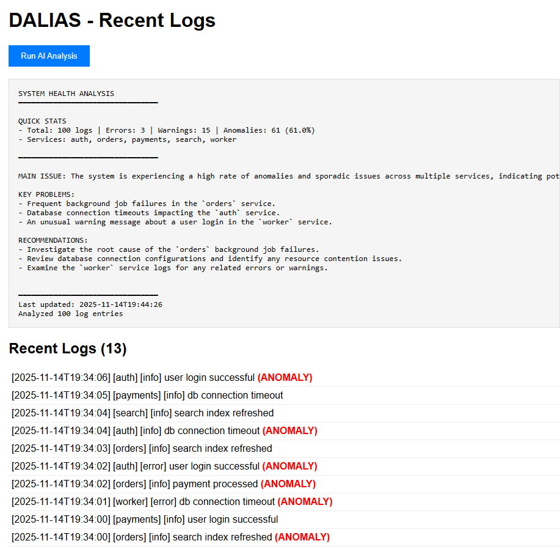

# DALIAS — Distributed Agentic Log Intelligence and Analytics System

This repository contains a minimal end-to-end implementation: ingestion -> Kafka (Redpanda) -> processing -> MongoDB -> Agent (LLM) -> Dashboard.

#### Output



## Quick start
1. Copy `.env.example` to `.env` and fill GEMINI_API_KEY
2. Build and run:
   ```bash
   docker-compose up --build
   ```
3. Visit http://localhost:8000 to view dashboard

## Notes
- Agent uses Google Gemini API; set GEMINI_API_KEY in environment.
- Replace Redpanda with an external Kafka cluster if needed.
- To read a more detailed overview, refer to the 'Report.pdf' file.
